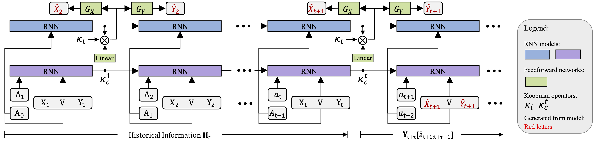

# Enhancing Counterfactual Estimation: A Focus on Temporal Treatments

## Project Description



**Counterfactual Temporal Dynamics Network via Neural Koopman Operators (CTD-NKO)**

The architectural diagram of CTD-NKO is illustrated as follows: An <span style="color:#B6A0DF;">RNN</span> utilizes historical information to learn the system state; another <span style="color:#90B2DF;">RNN</span> combines current treatment and historical information to learn the Koopman operator. The symbol $\bigotimes$ represents operations within the Koopman space. Subsequently, the system employs feedforward networks $G_X$ and $G_Y$ to perform counterfactual estimation based on the predicted next system state. CTD-NKO is developed utilizing observational data from previous time points $(1,\cdots,t)$, and it employs an autoregressive model to estimate counterfactuals at subsequent time points $(t+1,\cdots,t+\tau)$.

Further details on installation, configuration, and utilization of CTD-NKO to fully leverage its capabilities for your counterfactual estimation tasks will be provided in the subsequent sections.

## Installation Instructions

### Establishing a Virtual Environment
For an isolated and manageable development setup, we advise utilizing a `conda` virtual environment. If Anaconda or Miniconda is not already installed on your system, you can install it by following the guidelines available on the [Anaconda website](https://www.anaconda.com/products/distribution) or the [Miniconda website](https://docs.conda.io/en/latest/miniconda.html). Once installed, you can create and activate a new conda environment using these commands:

```bash
conda create -n ctd-nko python=3.8
conda activate ctd-nko
```


### Dependency Installation

This project leverages essential Python libraries including:

1. [Pytorch-Lightning](https://pytorch-lightning.readthedocs.io/en/latest/) for constructing deep learning models.
2. [Hydra](https://hydra.cc/docs/intro/) for streamlined management of command line arguments.

After establishing and activating your virtual environment, proceed to install the necessary dependencies listed in the `requirements.txt` file located in your project directory. Execute the following commands to navigate to your project directory and install these dependencies:

```bash
cd path/to/your/project
pip install -r requirements.txt
```

These instructions will ensure your environment is fully prepared and operational.


## Datasets

To run experiments, you need to specify a dataset or dataset generator, along with any additional required parameters. 

- For the FS-Tumor dataset:
  ```bash
  # Single sliding treatment
  +dataset=cancer_sim
  # Random trajectories
  +dataset=cancer_sim_random
  ```

- For the MIMIC III Semi-synthetic Simulator (SS-MIMIC):

  ```bash
  +dataset=mimic3_synthetic
  ```

- For the MIMIC III Real-world dataset (RW-MIMIC):

  ```bash
  +dataset=mimic3_real
  ```

Please note that before running experiments with the MIMIC III datasets, you should place the MIMIC-III-extract dataset ([all_hourly_data.h5](https://github.com/MLforHealth/MIMIC_Extract)) in the `data/processed/` directory of your project. 


## Reproduction of Results

- For the FS-Tumor dataset: 

  ```bash
  # Reproducing the experimental results of the CTD-NKO at gamma=${gamma} with seed=${seed}
  python runnables/train.py +dataset=cancer_sim +backbone/wt=cancer +backbone/hparams/cancer=${gamma} exp.seed=${seed} exp.logging=False
  ```

  To reproduce the experimental results presented in our paper, you can directly execute the following script:

  ```bash
  ./train_cancer.sh ${cuda_device} ${gamma}
  # Here, ${gamma} should be selected from the set {zero, one, two, three, four}.

- For the MIMIC III Semi-synthetic Simulator (with multiple treatments and outcomes):

  ```bash
  # Reproducing the experimental results of the CTD-NKO with seed=${seed}
  python runnables/train.py +dataset=mimic3_synthetic +backbone/wt=mimic_synthetic +backbone/hparams=mimic_synthetic exp.seed=${seed} exp.logging=False
  ```

  To reproduce the experimental results presented in our paper, you can directly execute the following script:

  ```bash
  ./train_real.sh ${cuda_device}
  ```

- For the MIMIC III Real-world dataset:

  ```bash
  # Reproducing the experimental results of the CTD-NKO with seed=${seed}
  python runnables/train.py +dataset=mimic3_real +backbone/wt=mimic_real +backbone/hparams=mimic_real exp.seed=${seed} exp.logging=False
  ```
	To reproduce the experimental results presented in our paper, you can directly execute the following script:

  ```bash
  ./train_sys.sh ${cuda_device}
  ```


To reproduce the experimental results of the **ablation** studies presented in our paper, you can directly execute the following script:

```bash
./ablation.sh ${cuda_device}
```

To reproducethe the results of other baselines, please refer to the [CausalTransformer repository](https://github.com/Valentyn1997/CausalTransformer). Our approach for data generation closely follows the methodology described there, with minor modifications specific to CTD-NKO that do not alter the generation results. To ensure fairness in comparative experiments, we employed a consistent set of seeds [**10,101,1010,10101,101010**] across all baselines, in line with the practices in [CausalTransformer](https://proceedings.mlr.press/v162/melnychuk22a/melnychuk22a.pdf).


### Experimental Platform

For rigorous and fair comparison across all experiments, CTD-NKO and all competing baseline models were evaluated using the following computational resources:

**Hardware Specifications**

- **Processor (CPU)**: AMD Ryzen 5 7600 6-Core Processor
- **Graphics Processing Units (GPUs)**: NVIDIA A800 80GB PCIe

